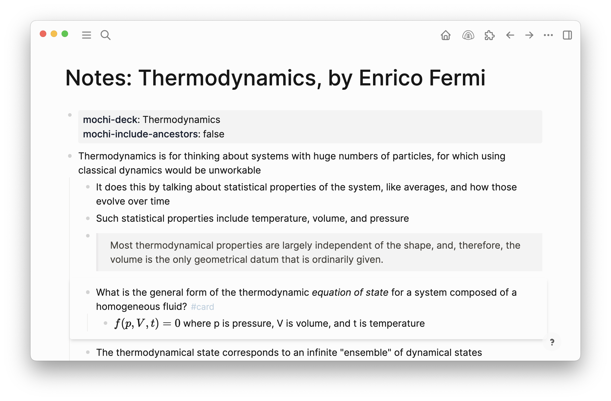
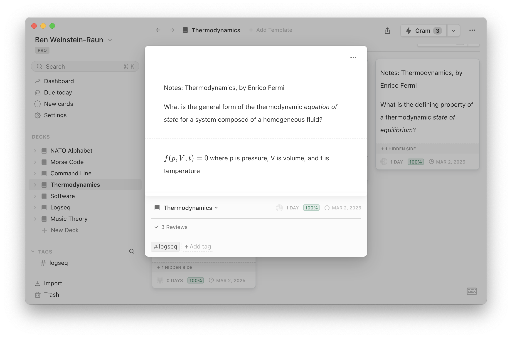
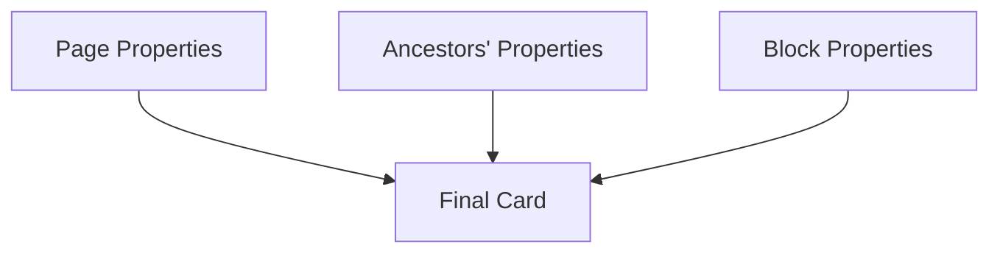

# Logseq → Mochi Sync

 One-way synchronization of flashcards from Logseq to Mochi

 

 ↓

 

 ## Features

 - Syncs Logseq blocks tagged `#card` to Mochi
 - Converts Logseq clozes (`{{cloze}}`) to Mochi format
 - Supports`mochi-deck` property to specify a custom deck (or fall back to default deck)
 - Optionally:
   - Include page titles in cards
   - Include ancestor block context
   - Delete orphaned Mochi cards

## Property Handling & Configuration

### Property Cascade Hierarchy
Properties are merged in this order (later entries override earlier ones):
1. Page properties (if "Include Page Properties" enabled)
2. Ancestor block properties (if "Include Ancestors" enabled)
3. Current block properties (highest priority)
4. Automatically injected `mochi-id` property



### Supported Special Properties

| Property            | Format             | Description                                                                 |
|---------------------|--------------------|-----------------------------------------------------------------------------|
| `mochi-deck`        | Deck name string   | Specifies which Mochi deck to use for the card                              |
| `mochi-tags`        | Comma-separated list | Sets custom tags for the card in Mochi                                     |
| `mochi-template`    | Template name string | Uses specified Mochi template for the card                                |
| `mochi-field-*`     | Field values       | Populates template fields (replace * with field name from your template)   |

### Examples

**Basic usage:**
```org
- Card content
  mochi-deck:: Chemistry 101
  mochi-tags:: important, exam-material
```

**Template usage:**
```org
- What's the capital of France?
  mochi-template:: Capital City
  mochi-field-City:: Paris
  mochi-field-Population:: 2.1 million
```

### Configuration Options
These settings control property inheritance:
- **Include Page Title**: Adds the parent page title at the top of card content  
  *(Enabled in settings by default)*
- **Include Page Properties**: Inherit properties from the containing page  
  *(Enabled in settings by default)*
- **Include Ancestors**: Inherit properties from parent blocks  
  *(Enabled in settings by default)*
- **Card-specific Settings**: Block properties override all inherited values  
  *(Always enabled)*

 ## Installation (Manual)

 ⚠️ Not yet available in Logseq Marketplace. Install manually:
 1. Clone repo
 2. `pnpm install && pnpm build`
 3. Load plugin in Logseq via "Load unpacked plugin"
